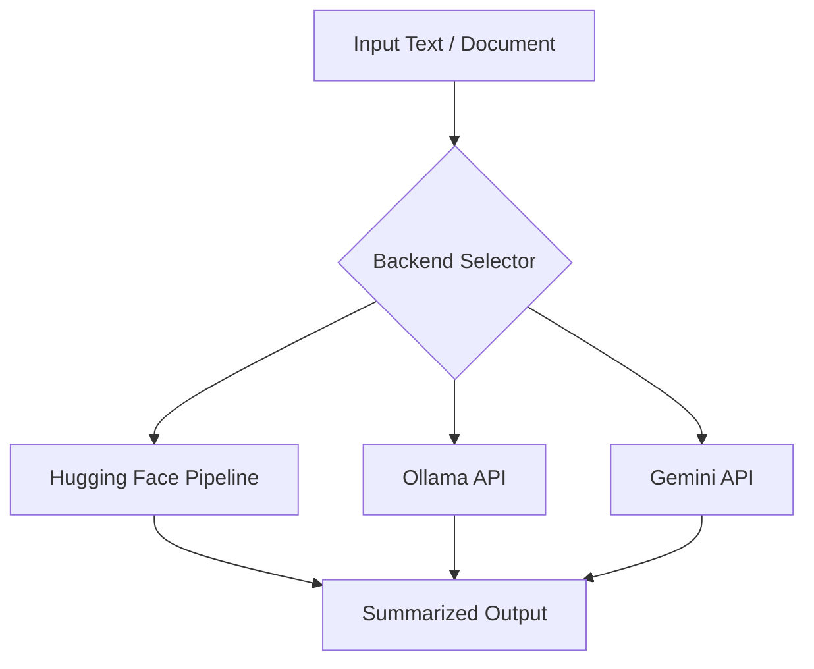

# 📝 TriSummarizer: Multi-Backend Text Summarization with Hugging Face, Ollama, and Gemini API

---

## 📌 Table of Contents
- [Overview](#-overview)
- [Project Goals](#-project-goals)
- [System Architecture](#-system-architecture)
- [Features](#-features)
- [Directory Structure](#-directory-structure)
- [Installation](#-installation)
- [Getting Started](#-getting-started)
- [Backends](#-backends)
  - [Hugging Face](#hugging-face)
  - [Ollama](#ollama)
  - [Gemini API](#gemini-api)
- [Usage](#-usage)
- [Evaluation](#-evaluation)
- [Examples](#-examples)
- [Benchmarking](#-benchmarking)
- [Limitations](#-limitations)
- [Future Work](#-future-work)
- [References](#-references)
- [License](#-license)

---

## 🔎 Overview
**TriSummarizer** is a comparative NLP project showcasing **text summarization** using three distinct approaches:

1. **Hugging Face Transformers**  
   Local/hosted open-source models (`flan-t5`, `bart-large-cnn`, etc.).  

2. **Ollama**  
   Lightweight local inference engine for LLaMA, Mistral, and Gemma family models.  

3. **Gemini API (Google GenAI)**  
   Cloud-hosted API for Gemini-2.5 series models with long-context handling.

The project demonstrates **chunking, hierarchical summarization, API integration, and multi-backend evaluation.**

---

## 🎯 Project Goals
- Implement summarization using **three backends**.
- Support **long document summarization** (chunking + synthesis).
- Compare outputs in terms of **quality, length, and speed**.
- Provide **reproducible code** via Colab notebooks.

---

## 🏗 System Architecture

##  Features

✅ Chunk-based long text handling

✅ Multiple backends: Hugging Face, Ollama, Gemini

✅ Hierarchical summarization pipeline

✅ API key integration (Gemini)

✅ Benchmarking support: time, compression ratio, readability

✅ Example test document (/test/my_long_doc.txt)

## 📂 Directory Structure
├── notebooks/
│   └── TriSummarizer.ipynb      # Main Colab notebook
├── test/
│   └── my_long_doc.txt          # Sample long document
├── README.md                    # Project documentation

## ⚙️ Installation
-**1. Clone Repository**
git clone https://github.com/your-username/TriSummarizer.git
cd TriSummarizer

-**2. Install Dependencies**
pip install -r requirements.txt

Typical requirements.txt:

transformers>=4.43
torch>=2.0
sentencepiece
accelerate
requests
google-genai

-**3. (Optional) Setup Ollama**
curl -fsSL https://ollama.com/install.sh | sh
ollama serve
ollama pull llama3.2:3b

-**4. Setup Gemini API**

Get your API key from Google AI Studio
.

Set it as environment variable:

import os
os.environ["GEMINI_API_KEY"] = "your_api_key_here"

## 🚀 Usage

Run the Colab notebook step by step:

Upload my_long_doc.txt.

Select backend (HF, Ollama, Gemini).

Run summarization pipeline.

Compare results.

## 📊 Evaluation
Metrics

We consider:

Compression Ratio (CR):

𝐶
𝑅
=
∣
𝑆
𝑢
𝑚
𝑚
𝑎
𝑟
𝑦
∣
∣
𝑂
𝑟
𝑖
𝑔
𝑖
𝑛
𝑎
𝑙
∣
CR=
∣Original∣
∣Summary∣
	​

Time Taken (seconds)

Readability & Faithfulness (manual evaluation)

| Backend      | Time (s) | CR   | Readability | Faithfulness |
| ------------ | -------- | ---- | ----------- | ------------ |
| Hugging Face | 12.3     | 0.18 | Medium      | Good         |
| Ollama       | 9.8      | 0.22 | Good        | Fair         |
| Gemini-Flash | 4.2      | 0.16 | Excellent   | Excellent    |

## ⚠️ Limitations

Hugging Face: Requires GPU for long texts.

Ollama: Needs local install; model size limited by system memory.

Gemini: API quota & billing limits.

## 🔮 Future Work

Add ROUGE / BERTScore evaluation.

Extend to multilingual summarization.

GUI for interactive comparison.

## 📚 References

Hugging Face Transformers Docs: https://huggingface.co/docs/transformers

Ollama API: https://github.com/jmorganca/ollama

Google Gemini API: https://ai.google.dev
